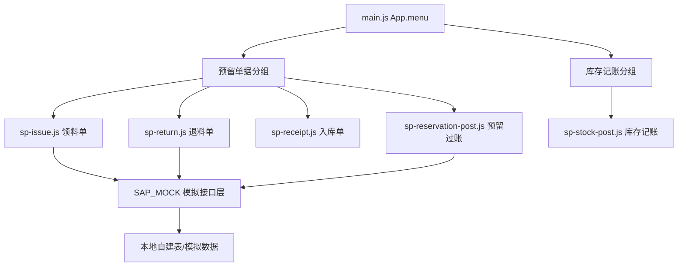

## 产品概述

车间领料、退料、成品入库与库存记账管理功能，整合现有碎片化菜单。业务基础为 SAP 预留单概念：MES 创建预留单后调用 SAP 创建预留接口，SAP 返回预留编号，MES 才将预留信息存入自建表；修改同样需等待 SAP 反馈。跨车间场景下，A 车间创建领料单（预留），B 车间对预留执行过账。

## 菜单结构（整合后）

一级菜单「库存管理」下二级分组：

- **预留单据**：领料单、退料单、入库单、预留过账
- **库存记账**：单一入口，创建时选择记账类型（库位转移、库存报废、库存差异调整、客供料收发、内部订单投料、成本中心投料）
- 保留：物料主数据、备品备件管理（库存查询/备件领用/安全库存预警）、采购申请管理

## 核心功能

### 领料单

- 创建弹窗选择 4 种方式：①领取即消耗-内部订单 ②领取即消耗-成本中心 ③领至暂存间（A 库位→B 库位，不填流程订单）④按生产指令领至暂存间（填写流程订单编号）
- 创建/修改均先调 SAP 创建/修改预留接口，SAP 返回预留编号并反馈成功后，MES 才存入本地；失败展示错误并提供重试
- 列表页操作列仅「查看」按钮（btn btn-blue btn-sm），编辑在查看弹窗内

### 退料单

- 创建弹窗选择 3 种方式：从内部订单退料、从成本中心退料、基于现有库存退料
- 对应领料部分消耗后退回场景，同样走 SAP 预留接口（退料移动类型）
- 列表查看/弹窗内编辑

### 入库单

- 成品入库：按生产订单入库，填写生产订单号、物料、数量、批次、目标库位
- 列表查看/弹窗内编辑

### 预留过账

- 展示待过账预留列表（A 车间领 B 车间物料），B 车间选择预留后执行过账（SAP 过账接口模拟，返回物料凭证号）
- 支持按预留号、发出/收货车间、状态筛选

### 库存记账

- 统一入口，创建弹窗选择 6 种记账类型之一（库位转移/库存报废/库存差异调整/客供料收发/内部订单投料/成本中心投料）
- 列表按类型筛选，行项目仅「查看」，编辑在弹窗内

## 设计风格

沿用项目性冷淡/极简商务风：中性灰背景 + 深蓝 #1E3A5F 单一强调色，状态用小面积语义色徽章（绿=成功/红=错误/黄=待处理），无装饰性元素。

## 技术栈

- 原生 HTML + JavaScript（无构建工具），沿用现有 V3 架构：main.html 引入 js 文件，页面对象 { render()/init() } 由 main.js 的 pageMap 注册挂载
- 样式沿用 V3/css/common.css（性冷淡商务风样式库）
- 数据持久化沿用 js/core/persistence.js 模式（模拟数据存页面文件底部 + localStorage 可选）
- 文档输出：Markdown PRD（参考采购申请PRD.md 格式）

## 实现思路

以 V3/js/pages/sp-purchase.js 为模板（创建方式选择弹窗 showModal + modal-xl、查看弹窗内编辑、列表筛选分页），新建 5 个页面对象；新建公共 SAP 接口模拟模块供领料/退料/过账共用；在 main.js 的 App.menu 中新增「预留单据」「库存记账」分组并注册 pageMap 路由；main.html 按顺序引入新文件。

## 关键设计决策

1. **SAP 接口模拟**：新建 js/core/sap-mock.js 提供 `SAP_MOCK.createReservation()` / `SAP_MOCK.updateReservation()` / `SAP_MOCK.postGoodsMovement()` 三个 Promise 接口，延迟模拟网络 + 随机成功/失败分支，供 4 个单据页面共用（DRY），对接真实后端时仅需替换此模块
2. **创建方式选择弹窗**：复用 sp-purchase.js 的 openNewModal 模式（showModal + 卡片网格），领料 4 种/退料 3 种/库存记账 6 种类型卡片，点击后进入对应表单
3. **菜单整合**：purchase-demand 一级菜单 label 改为「库存管理」，在 groups 中新增「预留单据」（4 个 items）与「库存记账」（1 个 item），删除原 6 个分散入口的占位（当前 main.js 中并无这些占位，实际为新增）；pageMap 注册 5 个新路由
4. **数据模型**：模拟数据数组置于各页面文件底部（与 spPurchaseData 同模式），字段对齐 SAP 预留/物料凭证概念（reservationNo、materialDocNo、移动类型）
5. **性能与可靠性**：列表本地分页 + 筛选；SAP 模拟调用带 30s 超时保护与 loading 层（复用曾删除的 _withTimeout 模式思想）；提交前表单校验（必填项、数量>0、库位必选）

## 系统架构



## 目录结构

```
V3/
├── main.html                    # [MODIFY] 引入 5 个新页面 js + sap-mock.js（data.js 之后、main.js 之前）
├── js/
│   ├── core/
│   │   └── sap-mock.js          # [NEW] SAP 预留/过账接口模拟：createReservation/updateReservation/postGoodsMovement，含延迟、超时、成功/失败分支、预留编号/物料凭证号生成
│   ├── pages/
│   │   ├── sp-issue.js          # [NEW] 领料单页面：render/init/筛选分页/创建方式选择弹窗(4种)/表单弹窗(创建+编辑)/查看弹窗/SAP创建预留模拟
│   │   ├── sp-return.js         # [NEW] 退料单页面：创建方式弹窗(3种)/表单/查看/编辑/SAP修改预留模拟
│   │   ├── sp-receipt.js        # [NEW] 入库单页面：成品入库表单(生产订单号/批次/库位)/查看/编辑
│   │   ├── sp-reservation-post.js  # [NEW] 预留过账页面：待过账预留列表/筛选/过账执行弹窗/SAP过账模拟返回物料凭证号
│   │   └── sp-stock-post.js     # [NEW] 库存记账页面：创建方式弹窗(6种类型)/类型筛选列表/查看/弹窗内编辑
│   └── main.js                  # [MODIFY] purchase-demand 改 label 为「库存管理」；groups 新增「预留单据」「库存记账」；pageMap 注册 sp-issue/sp-return/sp-receipt/sp-reservation-post/sp-stock-post
├── 车间领退料与库存记账PRD.md    # [NEW] PRD：业务背景、4+3+1+6 种创建方式定义、SAP 接口时序、菜单结构、字段说明、状态流转、交互规则
└── MES系统数据字典.xlsx          # [MODIFY] 追加领料单/退料单/入库单/预留过账/库存记账相关表结构（如用户确认需要）
```

## 关键代码结构

```js
// sap-mock.js —— 公共 SAP 模拟接口（对接真实后端仅替换此文件）
const SAP_MOCK = {
  createReservation(payload)  {}, // → Promise<{reservationNo:'1000000xxx', status:'success'}>
  updateReservation(resNo, payload) {}, // → Promise<{ok:true}>，模拟 SAP 反馈后再回写本地
  postGoodsMovement(payload)  {}  // → Promise<{materialDocNo:'49xxxxxx'}>
};

// sp-issue.js 页面对象骨架（其余 4 页同构）
const SpIssue = {
  page:1, pageSize:20, filteredData:[],
  issueType: '',   // 供菜单透传分流（可选）
  render() {}, init() {}, renderTable() {},
  openNewModal() {},        // 4 种创建方式卡片弹窗
  openForm(type) {},        // 创建表单
  openViewModal(docNo) {},  // 查看弹窗（内含编辑入口）
  _saveIssue(isEdit) {},    // 先调 SAP_MOCK 再回写本地
};
```

领料单数据结构：`{ docNo:'PL-20260601-001', issueType:'consume-internal-order'|'consume-cost-center'|'staging-move'|'staging-process-order', reservationNo, plant:'1000', issueLocation, targetLocation, internalOrderNo, costCenter, processOrderNo, issueDept, applicant, issueDate, status:'草稿'|'待同步'|'已同步'|'部分过账'|'已完成', lines:[{itemNo,matCode,matName,qty,unit,batch}] }`；退料/入库/过账/库存记账数据模型类似，含 materialDocNo、postType、moveType 等字段。

## 设计风格

沿用项目既定性冷淡/极简商务风，无新视觉体系，保证与现有系统观感一致。

## 页面规划（5 个核心页面）

1. 领料单列表页：渐变深蓝页头（标题+「创建领料单」按钮）→ 筛选栏（单号/领料类型/发出库位/请领部门/状态）→ 表格（操作列仅「查看」btn btn-blue btn-sm）→ 分页
2. 退料单列表页：结构与领料单一致，筛选含退料类型；创建弹窗 3 种方式
3. 入库单列表页：筛选（单号/生产订单/目标库位/状态）；创建为单一成品入库表单
4. 预留过账页：待过账预留列表，突出「发出车间→收货车间」关系，行项目「过账」按钮在查看弹窗内，状态徽章区分待过账/已过账
5. 库存记账页：类型徽章列（6 种类型）+ 类型筛选下拉；创建弹窗 6 种类型卡片选择

## 交互规则

- 所有创建按钮点击后先弹「选择方式」卡片弹窗（modal-xl，卡片 2~4 列网格，hover 微动效），再进对应表单
- 列表行操作列仅「查看」；编辑按钮位于查看弹窗内部
- 弹窗尽量大：modal-xl（width:90vw / max-width:1200px+），表单字段分行排列，避免滚动条
- SAP 调用期间显示 loading 层（深蓝旋转圈 + 「正在与 SAP 同步，请等待…」）；失败弹错误框（重试/取消）